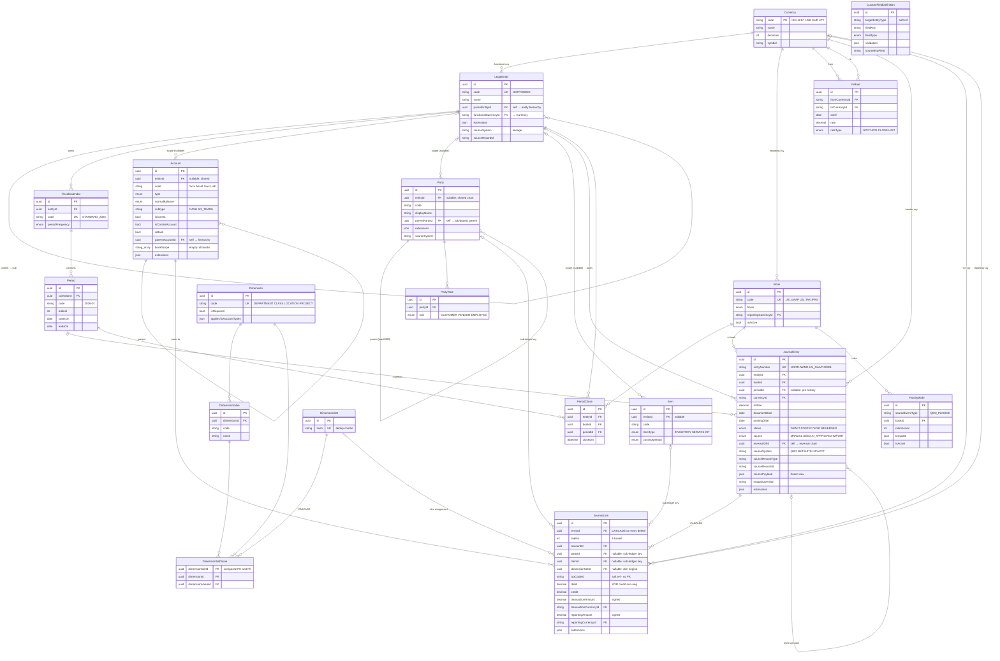

# Schema ERD

Entity-relationship diagram for the `ledger-core` schema as of v0.2 (Layers 1 + 2 of the universal accounting substrate, with empty seams for Layers 3–5). Authored alongside [universal-schema.md](universal-schema.md) — that file holds the architectural decisions; this one shows how those decisions sit in the tables.

Cardinality follows mermaid convention: `||` = exactly one, `|o` = zero or one, `o{` = zero or many. Arrows read from parent (left) to child (right).

## How to read this

**The graph has three centers of gravity.** All arrows ultimately funnel into one of them.

1. **`Currency`** is the universal hub. Every monetary thing in the system traces back to it — entity functional currency, book reporting currency, FX rate pairs, journal entry header currency, and the per-line txn/reporting columns. It uses ISO 4217 codes as its primary key (USD, EUR, JPY), not a UUID, because those codes are globally stable.

2. **`LegalEntity` + `Book`** are the multi-tenancy axis. Every posting belongs to exactly one `(LegalEntity, Book)`. The relationship `LegalEntity ||--o{ JournalEntry` plus `Book ||--o{ JournalEntry` is what makes Pattern 2 (full parallel ledgers) possible: a single source event in the future posting-rules engine fans out into N JournalEntry rows, one per relevant book, all sharing the same `sourceRecordId` in lineage.

3. **`JournalEntry → JournalLine`** is the posting substrate. The `CASCADE` is deliberate: lines never outlive their header. Lines then reach outward into Account (mandatory), Party / Item / DimensionSet (all nullable sub-ledger keys), and Currency (twice — for txn-currency and reporting-currency views of the same signed amount).

## The nullable FKs are intentional

Four "optional parent" edges (`|o--o{`) carry architectural weight:

- **`LegalEntity → Account/Party/Item`** is nullable because the same master record can be shared across entities (consolidated chart) or scoped to one. Setting it to null is "shared"; setting it to an entity is "this-entity-only."
- **`Period → JournalEntry`** is nullable so backfilled pre-go-live historical entries (with no defined fiscal period) can still post.
- **`DimensionSet → JournalLine`** is nullable because QBO data has 0–2 dimensions and NetSuite data has 8+. The same schema absorbs both without a fixed `class_id`/`department_id` column — which is the anti-pattern the dimension engine exists to avoid.
- **`Currency → JournalLine`** (txn + reporting) is nullable because the line typically inherits from the header; only intercompany / FX-gain-loss lines specify per-line currency.

## Self-references (the four loops)

Four tables reference themselves — these are the hierarchies that ERP systems all have but model differently.

- **`LegalEntity → LegalEntity` (parent)**: parent/subsidiary trees for consolidation.
- **`Account → Account` (parent)**: chart of accounts hierarchy (NetSuite parent accounts, Intacct GL hierarchy).
- **`Party → Party` (parent)**: Customer:Job / Project / WBS / Sage Job — all collapse here per the spec's anti-pattern rule.
- **`JournalEntry → JournalEntry` (reversalOf)**: the corrections chain. A reversal links back to the entry it cancels; both stay in the ledger forever.

## What's NOT in this diagram

- The lineage columns (`sourceSystem` / `sourceRecordId` / `sourcePayload` / `mappingVersion`) appear on most entities but they're **not foreign keys** — they reference external ERPs by string, never by UUID. That's why source-system primary keys aren't reused as schema keys (per the spec's anti-pattern list).
- `CustomFieldDefinition` has no FK to any other table — its `targetEntityType` is a string ("party", "gl_entry_line", etc.). The actual values live in each entity's `extensions Json` column. This is the Layer 5 "no EAV" decision in practice.
- The sub-ledger tables that arrive in the next batch — `ArOpenItem`, `ApOpenItem`, `FixedAsset` + `FixedAssetBookAttributes`, `Lease`, `RevenueContract` — would attach to `JournalLine` via `partyId`/`itemId` lifecycles and to `Book` via the `*_book_attributes` join tables. None of those exist yet.
