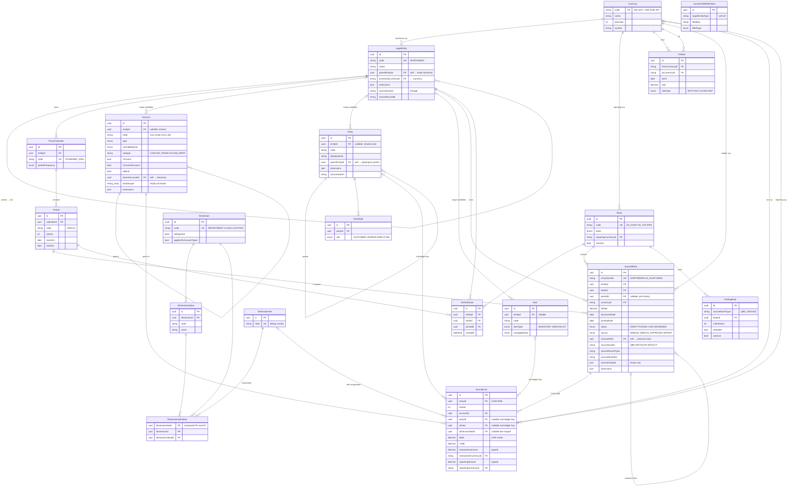

# Schema ERD

Entity-relationship diagrams for the `ledger-core` schema as of v0.3 (Layers 1, 2, 3 + native sub-ledgers + posting rules + custom-field metadata). Authored alongside [universal-schema.md](universal-schema.md) — that file holds the architectural decisions; this file shows how those decisions sit in the tables.

Two diagrams below: the **core substrate** (the original v0.2 universal layers) and the **sub-ledger detail** (added in v0.3). Cardinality follows mermaid convention: `||` = exactly one, `|o` = zero or one, `o{` = zero or many. Arrows read from parent (left) to child (right).

## Core substrate (Layers 1 – 3)

## Native sub-ledgers (v0.3)

The sub-ledger tables sit alongside the GL substrate. They reference the same `LegalEntity`, `Book`, `Party`, and `JournalEntry` rows but track lifecycle state the GL doesn't (open balance, accumulated depreciation, recognition progress). Every sub-ledger has a `*BookAttributes` join keyed by `(record_id, book_id)` — that's where book-divergent accounting policy lives.

```mermaid
erDiagram
    LegalEntity { uuid id PK }
    Book        { uuid id PK }
    Party       { uuid id PK }
    Currency    { string code PK }
    JournalEntry { uuid id PK }

    ArOpenItem {
        uuid id PK
        uuid entityId FK
        uuid bookId FK
        uuid partyId FK
        uuid openedByEntryId FK "→ invoice JE"
        string referenceNumber
        date openedDate
        date dueDate
        decimal originalAmount
        decimal currentBalance
        string currencyId FK
        enum status "OPEN PARTIAL APPLIED WRITTEN_OFF"
        string controlAccountCode "AR roll-up account"
        json extensions
    }
    ArApplication {
        uuid id PK
        uuid openItemId FK "CASCADE"
        uuid appliedByEntryId FK "→ payment JE"
        decimal appliedAmount
        date appliedDate
    }
    ApOpenItem {
        uuid id PK
        uuid entityId FK
        uuid bookId FK
        uuid partyId FK
        uuid openedByEntryId FK "→ bill JE"
        decimal originalAmount
        decimal currentBalance
        enum status
        string controlAccountCode "AP roll-up account"
    }
    ApApplication {
        uuid id PK
        uuid openItemId FK "CASCADE"
        uuid appliedByEntryId FK "→ vendor pmt JE"
        decimal appliedAmount
        date appliedDate
    }
    FixedAsset {
        uuid id PK
        uuid entityId FK
        string code UK "LAPTOPS-2026-001"
        string description
        uuid vendorPartyId FK "nullable"
        date acquisitionDate
        decimal acquisitionCost
        string acquisitionCurrencyId FK
        string assetAccountCode "GL acct"
        enum status "IN_SERVICE IDLE DISPOSED"
    }
    FixedAssetBookAttributes {
        uuid assetId PK "composite PK and FK CASCADE"
        uuid bookId PK
        int usefulLifeMonths
        enum depreciationMethod "STRAIGHT_LINE MACRS_5_HY NONE"
        date inServiceDate
        decimal salvageValue
        decimal accumulatedDepreciation
        date lastDepreciatedThrough
        string depreciationExpenseAccountCode
        string accumDepreciationAccountCode
    }
    Lease {
        uuid id PK
        uuid entityId FK
        string code UK "NYC-2026"
        uuid lessorPartyId FK "nullable"
        date leaseStartDate
        date leaseEndDate
        enum paymentFrequency
        decimal paymentAmount
        decimal totalUndiscountedPayments
        string currencyId FK
        enum status
    }
    LeaseBookAttributes {
        uuid leaseId PK "composite PK and FK CASCADE"
        uuid bookId PK
        enum classification "OPERATING FINANCE TAX_CASH_BASIS"
        decimal discountRate
        decimal rouAssetBalance
        decimal leaseLiabilityBalance
        date lastAmortizedThrough
        string rouAccountCode
        string liabilityAccountCode
        string expenseAccountCode
    }
    RevenueContract {
        uuid id PK
        uuid entityId FK
        string code UK "GLOBEX-2026-A1"
        uuid customerPartyId FK
        date contractStartDate
        date contractEndDate
        decimal totalContractValue
        string currencyId FK
        enum status
    }
    PerformanceObligation {
        uuid id PK
        uuid contractId FK "CASCADE"
        int sequenceNo
        decimal ssp "allocated SSP"
        enum recognitionPattern "POINT_IN_TIME OVER_TIME_STRAIGHT"
        date startDate
        date endDate
        decimal recognizedToDate
        string revenueAccountCode
        string deferredAccountCode
    }
    RevenueContractBookAttributes {
        uuid contractId PK "composite PK and FK CASCADE"
        uuid bookId PK
        enum recognitionBasis "ACCRUAL CASH"
        decimal cumulativeRecognized
    }

    LegalEntity ||--o{ ArOpenItem            : ""
    LegalEntity ||--o{ ApOpenItem            : ""
    LegalEntity ||--o{ FixedAsset            : ""
    LegalEntity ||--o{ Lease                 : ""
    LegalEntity ||--o{ RevenueContract       : ""

    Book ||--o{ ArOpenItem                   : "per-book lifecycle"
    Book ||--o{ ApOpenItem                   : "per-book lifecycle"
    Book ||--o{ FixedAssetBookAttributes     : "policy"
    Book ||--o{ LeaseBookAttributes          : "policy"
    Book ||--o{ RevenueContractBookAttributes : "policy"

    Party ||--o{ ArOpenItem                  : "customer"
    Party ||--o{ ApOpenItem                  : "vendor"
    Party |o--o{ FixedAsset                  : "vendor (nullable)"
    Party |o--o{ Lease                       : "lessor (nullable)"
    Party ||--o{ RevenueContract             : "customer"

    Currency ||--o{ Lease                    : "lease ccy"
    Currency ||--o{ RevenueContract          : "contract ccy"
    Currency ||--o{ FixedAsset               : "acquisition ccy"

    JournalEntry ||--o{ ArOpenItem           : "opened by"
    JournalEntry ||--o{ ApOpenItem           : "opened by"
    JournalEntry ||--o{ ArApplication        : "applied by"
    JournalEntry ||--o{ ApApplication        : "applied by"

    ArOpenItem ||--o{ ArApplication          : "CASCADE"
    ApOpenItem ||--o{ ApApplication          : "CASCADE"
    FixedAsset ||--o{ FixedAssetBookAttributes : "CASCADE (one per book)"
    Lease ||--o{ LeaseBookAttributes         : "CASCADE"
    RevenueContract ||--o{ PerformanceObligation : "CASCADE"
    RevenueContract ||--o{ RevenueContractBookAttributes : "CASCADE"
```

## How to read this

### Core substrate — three centers of gravity

1. **`Currency`** is the universal hub. ISO 4217 codes as PK (USD, EUR, JPY).
2. **`LegalEntity` + `Book`** are the multi-tenancy axis. Every posting belongs to one `(LegalEntity, Book)`.
3. **`JournalEntry → JournalLine`** is the posting substrate.

### Sub-ledger pattern — `*BookAttributes` is where divergence lives

Every sub-ledger has the same shape:

| Master record | Per-book attributes |
|---|---|
| `FixedAsset` (the physical thing) | `FixedAssetBookAttributes(assetId, bookId)` — useful life, method, accum dep |
| `Lease` (the contract) | `LeaseBookAttributes(leaseId, bookId)` — ASC 842 classification, ROU, liability |
| `RevenueContract` (the deal) | `RevenueContractBookAttributes(contractId, bookId)` — accrual vs cash basis |

The single physical asset / lease / contract row holds invariant facts (cost, dates, parties). The `*BookAttributes` row holds the **policy** for one book. Three books → three attribute rows → three different depreciation schedules off the same $24k laptops.

This is the engine of book-tax differences. The `getBookTaxDifference` report (`src/lib/accounting/reports/book-tax-difference.ts`) is just a diff between two `(entity, book)`-scoped trial balances; the *sources* of the difference live in these tables.

### Sub-ledger lifecycle — open / apply / close

`ArOpenItem` and `ApOpenItem` are the open-item registers the spec calls out: a bill creates an AP open item, it is not itself AP. The invariant the tests enforce:

> Sum of `currentBalance` for items with status `(OPEN, PARTIAL, REOPENED)` per `(entity, book)` equals the AR/AP control account balance from the trial balance.

`ArApplication` and `ApApplication` are the cash-application audit trail — every dollar that moves an open item gets a row, linking the open item to the JournalEntry that did the moving.

### Why per-book open items?

`ArOpenItem` has `bookId`. Same invoice → multiple AR open items, one per book. Looks redundant for the common case (book and tax AR are usually identical) but it's load-bearing for cash-basis-tax customers: when the GAAP book has an open AR for an invoiced-but-uncollected sale and the tax book has nothing (cash-basis recognized only on collection), they need separate lifecycles. Per-book open items are the correct generalization.
